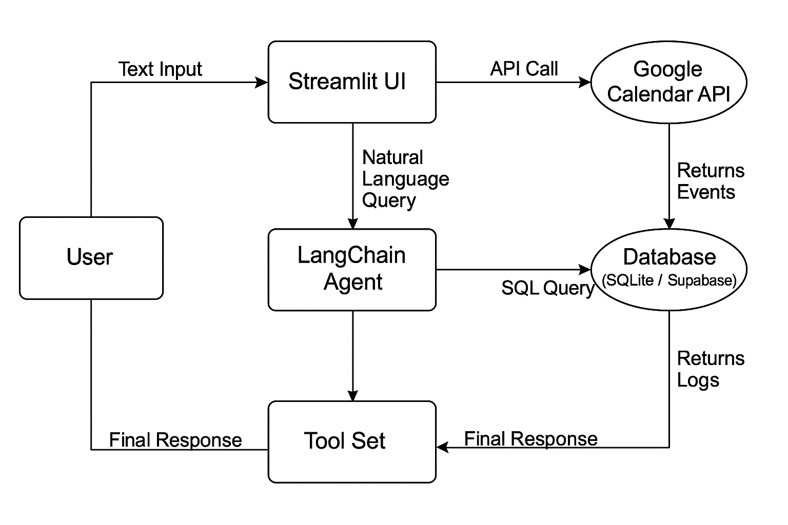

# Meeting Scheduler Agent

A production-grade AI agent that auto-schedules meetings using Google Calendar API and LangChain, with a Streamlit UI.

## Features
- Natural Language Understanding for scheduling requests.
- Google Calendar Integration (OAuth 2.0).
- Conflict detection and free slot suggestions.
- Database logging (Supabase/Sheets/SQLite).
- Streamlit User Interface.

## Demo

Here is a video demonstration of the Meeting Scheduler Agent in action:

https://github.com/Veeresh-hp/Auto_schedule_Using_Calendar_APIs/assets/demo.mp4

[Watch the Demo Video](https://drive.google.com/file/d/1xiP_z6ile7QKBAkxmoYEimkPC__WXkVf/view?usp=sharing)

## Architecture



## Setup

1.  **Clone the repository**
2.  **Install dependencies**:
    ```bash
    pip install -r requirements.txt
    ```
3.  **Environment Variables**:
    Copy `.env.example` to `.env` and fill in your API keys.
    ```bash
    cp .env.example .env
    ```
    Required: `GOOGLE_API_KEY` (for Google Gemini).
    Optional: `SUPABASE_URL`, `SUPABASE_KEY` (defaults to local SQLite if missing).

    **Note:** This agent uses Google's Gemini models. You need to get an API key from [Google AI Studio](https://aistudio.google.com/).
    
    Your `.env` file should look like this:
    ```
    GOOGLE_API_KEY=your_gemini_api_key_here
    ```

4.  **Google Credentials**:
    - Go to Google Cloud Console.
    - Create a project and enable Google Calendar API.
    - Create OAuth 2.0 Client ID (Desktop App).
    - Download JSON and rename to `credentials.json` in the root directory.

5.  **Run the App**:
    ```bash
    streamlit run app.py
    ```

## Usage
1.  Click "Authenticate" in the sidebar to log in to Google.
2.  Type commands like:
    - "Schedule a meeting with alice@example.com tomorrow at 10am."
    - "What do I have on Tuesday?"
    - "Find a free slot next Monday afternoon."

